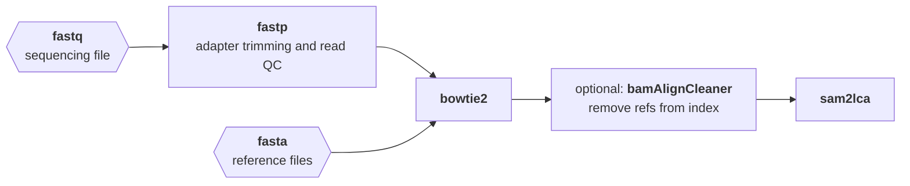

```mermaid
graph LR;
    fastq{{<b>fastq</b><br>sequencing file}}
    fasta{{<b>fasta</b><br>reference files}}
    fastp[<b>fastp</b><br>adapter trimming and read QC]
    bowtie2[<b>bowtie2</b>]
    bamAlignCleaner[optional: <b>bamAlignCleaner</b><br>remove refs from index]
    sam2lca[<b>sam2lca</b>]
    fastq --> fastp
    fastp --> bowtie2
    fasta --> bowtie2
    bowtie2 --> bamAlignCleaner
    bamAlignCleaner --> sam2lca
```